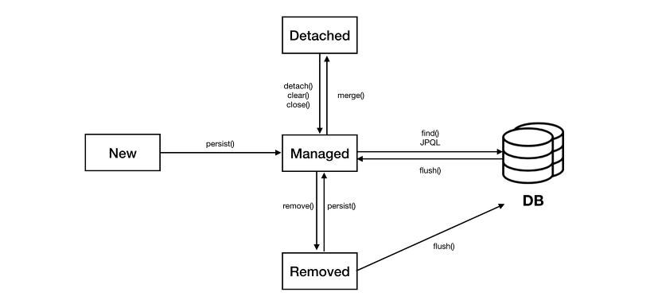

## [ Entity 개념 ]
Entity 생명주기

- Entity LifeCycle은 아래와 같다.

- 

Entity 생명주기 각 상태 설명

- 비영속 (new)
  - 영속성 컨텍스트와 관계 없는 상태
  - 상태 : 객체 생성
  - ```
    Person person = new Person("YongJun");
    ```
- 영속 (managed)
  - 영속성 컨텍스트에 저장된 상태
  - 상태 : 객체 생성 후, EntityManager를 통해 영속성 컨텍스트에 저장된 상태
  - ```
    entityManager.persist(person);
    ```
- 준영속 (detached)
  - 영속성 컨텍스트에 저장되었다가 분리된 상태
  - 상태 : 영속성 컨텍스트가 영속 상태였던 Entity를 관리하지 않음
    - (1) entityManager.detach(persion);
    - (2) entityManager.close(); //영속성 컨텍스트 종료
    - (3) entityManager.clear(); //영속성 컨텍스트 초기화
  - 준영속 상태가 되면 1차 캐시부터 SQL 저장소(쓰기 지연)까지 해당 엔티티를 관리하기 위한 모든 정보가 삭제됨.
  - 특징
    - (1) 영속성 컨텍스트가 제공하는 기능이 동작하지 않는다.
    - (2) 이미 한 번 영속성 상태였으므로 반드시 식별자 값을 가지고 있다. (@Id)
    - (3) 지연 로딩 시 문제가 발생한다.
- 삭제 (removed)
  - 삭제된 상태
  - 상태 : 영속성 컨텍스트와 DB에서 Entity 삭제
  - ```
    entityManager.remove(person);
    ```

flush() 설명

- flush()는 영속성 컨텍스트의 변경사항을 DB에 반영합니다.
- ```
  1. 변경 감지가 동작해 영속성 컨텍스트에 있는 모든 Entity를 스냅샷과 비교한 후 수정된 Entity를 찾는다.
  2. 수정된 Entity는 Update & Insert & Delete Query를 생성하여 SQL 저장소(쓰기 지연)에 저장한다.
  3. 트랜잭션 commit과 같은 동작이 발생할 때, 쓰기 지연 SQL 저장소의 쿼리를 DB에 반영한다.
  ```
- flush() 호출방법 3가지
  - (1) 직접 호출 : EntityManager.flush()를 직접 호출하여 flush. (거의 사용 X)
  - (2) 트랜잭션 commit 시 자동 호출 : JPA는 트랜잭션을 commit할 때 자동으로 flush()를 호출한다.
  - (3) JPQL 쿼리 실행 시 자동 호출 : JPQL과 같은 객체지향 쿼리를 호출할 때 쿼리 실행 직전에 자동으로 flush() 실행된다.

JPA 식별자

- Entitiy가 영속성 컨텍스트에 저장되기 위해서는 반드시 식별자값을 가지고 있어야 한다.
- Entity는 @Id 어노테이션을 이용하여 식별자값을 관리한다.
- 식별자값은 flush()를 통해 DB의 PK 컬럼과 매핑되는 값이다.
