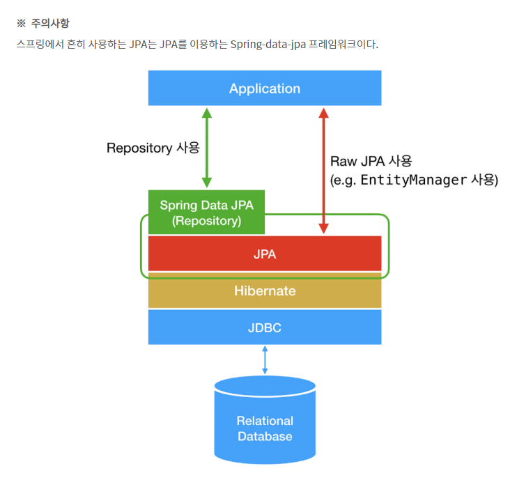

## JPA (Java Persistence Api) 개념

- 자바 진영에서 ORM(Obect Relational Mapping) 기술 표준으로 사용되는 인터페이스 라이브러리.
- JPA를 구현한 대표적인 프레임워크는 Hibernate, EclipseLink, DataNucleus 등이 있다.

JPA Layer 구조

 <br><br/>

ORM (Object Relational Mapping) 개념

- 객체와 관계형 데이터베이스의 데이터를 자동으로 Mapping 해주는 기술.
- OOP : Class <-> RDB : Table (객체 모델과 관계 모델을 서로 매핑)
- 객체 간의 관계를 바탕으로 SQL (DDL 및 DML)을 자동으로 생성 및 매핑해주는 기술.

JPA Persistence(영속성) 개념

- JPA에서 말하는 Persistence Context란 논리적인 개념이며, Entity를 영구적으로 저장하는 환경을 의미한다.
- Persistence Context에는 캐시가 존재하며, 영속 상태의 Entity는 모두 캐시에 저장된다.
- Entity는 캐시에 Map 형태로 저장되며, 키는 @Id로 매핑한 식별자고 값은 Entity 인스턴스다.
- EntityManagerInstance.find() 를 실행하면 캐시에서 Entity를 찾고, 해당 Entity가 없는 경우 DB에서 조회하여 캐시에 저장한 후 영속 상태인 객체를 반환한다.
- JPA는 Commit 시에 Persistence Context에 새로 저장된 Entity를 DB에 반영한다. 이러한 과정을 Flush라고 한다.
- flush란, Persistence Context 내 SQL 저장소에 저장된 변경 내용(등록, 수정, 삭제한 Entity 정보)을 DB에 동기화하는 작업을 말한다.
- JPA는 조회 시 Persistence Context에서 객체를 조회하므로, 여러 번 조회해도 Entity의 동일성이 보장된다.
- JPA는 트랜잭션을 지원하는 쓰기 지연을 수행한다.
  model 생성 -> Entity 생성 -> Persistence Context 내부 SQL 저장소에 저장 -> Transanction commit -> flush()
- 프록시 객체를 대신 생성해두고 객체 사용 시점에 영속성 데이터를 불러오는 지연 로딩을 수행한다.

Persistence Context 특징

- 영속성 컨텍스트와 식별자 값
  - 엔티티를 식별자 값(@id로 테이블의 기본 키와 매핑한 값)으로 구분한다.
  - 영속 상태는 식별자 값이 반드시 있어야 한다.
  - 식별자 값이 없으면 예외 발생.
- 영속성 컨텍스트와 데이터베이스 저장
  - Transaction commit -> flush()
- 영속성 컨텍스트가 엔티티를 관리하는 것의 장점
  - 1차 캐시
  - 동일성 보장
  - 트랜잭션을 지원하는 쓰기 지연
  - 변경 감지
  - 지연 로딩

Default JPA Example

```
//영속성 단위 이름이 jpa인 EntityManagerFactory 생성 (어플리케이션 당 1개)
EntityManagerFactory emf = Persistence.createEntityManagerFactory("jpa");

//DB 커넥션과 관계가 있으므로 스레드 간 공유 및 재사용하면 안됨 (스레드 당 1개)
EntityManager em = emf.createEntityManager();

//persistence context에 데이터 저장
em.persist(member);

//persistence context에서 정보 조회 및 DB 조회 후 결과 데이터 영속화 후 정보 조회 (영속 컨텍스트는 객체 반환)
String userId = "hongGD";
Member member = em.find(Member.class, userId);

//persistence context에서 entity 객체 변경 -> transaction commit 시 flush()
member.setUserName("변경할이름");

//persistence context에서 entity 객체 삭제 -> transaction commit 시 flush()
em.remove(member);
```

JPA 사용 장점

- 객체중심적인 개발이 가능하다.
- 생산성이 증가한다.
  - DDL문 자동 생성
  - 메서드를 통한 CRUD 가능 : SQL문 작성 필요 X
  - SQL 작성 및 JDBC API를 사용하는 반복작업 필요 X
- 유지보수가 쉽다.
  - 기존에는 필드 변경 시 모든 SQL을 변경해야 했다면, JPA는 필드만 추가하면 된다. (SQL은 JPA가 관리)
- OOP와 RDB간 패러다임 차이를 해결 : 객체 간의 관계를 바탕으로 테이블 관계 정의

JPA 사용 단점

- 자동 생성에서 오는 의도치 않은 오류 발생 가능성
- 복잡한 Query를 튜닝하는 과정에서 JPA 함수를 정의하는 것보다 SQL문을 작성하는 것이 나은 경우가 발생할 수 있다.
- 학습 난이도가 높다. (영속성에 대한 이해도가 낮으면 실무 적용이 어렵다.)
