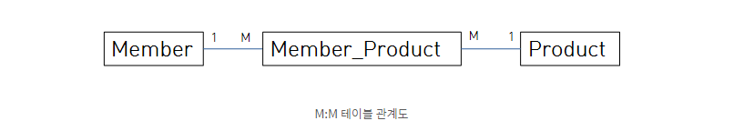

## 다대다(M:M) 단방향 관계

- 관계형 데이터베이스에서 다대다를 2개의 테이블로 표현할 수 없다. 두 테이블 중간에 관계 테이블을 하나 생성하여 관계를 맺는다.
- 
- 객체는 테이블과 달리 2개의 객체로 다대다 관계를 표현할 수 있다.
- Model 구조
- ```
  @Entity
  public class Member {
        @Id
        @GeneratedValue(strategy = GenerationType.IDENTITY)
        private Long id;

        private String memberName;

        @ManyToMany
        @JoinTable(
            name = "MEMBER_PRODUCT",
            joinColumns = @JoinColumn(name = "MEMBER_ID"),
            inverseJoinColumns = @JoinColumn(name = "PRODUCT_ID")
        )
        private List<Product> product = new ArrayList<>();
  }

  @Entity
  public class Product {
        @Id
        @GeneratedValue(strategy = GenerationType.IDENTITY)
        private Long id;

        private String productName;
  }
  ```

- Data 입출력 구현
- ```
  public class TestService {
        private final EntityManager em;

        @Transactional
        public void test() {
            Product product = new Product();
            product.setProductName("testProduct");
            em.persist(product);

            Member member = new Member();
            member.setMemberName("testMember");
            member.getProduct().add(product);
            em.persist(member);
        }
  }
  ```

  - 데이터 입력 시 MEMBER_PRODUCT 테이블은 신경쓰지 않아도 된다.
  - 다대일(M:1)과 동일하게 @ManyToMany가 알아서 연관 테이블에 값을 넣어준다.

<br><br/>

## 다대다(M:M) 양방향 관계

- 다대다 양방향은 연관관계 주인 반대편 객체에도 @ManyToMany를 붙여준다.
- 연관관계 주인이 아닌 객체에 mappedBy 속성을 붙여준다.
- Model 구조
- ```
  @Entity
  public class Product {
        @Id
        @GeneratedValue
        private Long id;

        private String productName;

        @ManyToMany(mappedBy = "product")
        private List<Member> members = new ArrayList<>();
  }

  @Entity
  public class Member {
        @Id
        @GeneratedValue(strategy = GenerationType.IDENTITY)
        private Long id;

        private String memberName;

        @ManyToMany
        @JoinTable(
            name = "MEMBER_PRODUCT",
            joinColumns = @JoinColumn(name = "MEMBER_ID"),
            inverseJoinColumns = @JoinColumn(name = "PRODUCT_ID")
        )
        private List<Product> product = new ArrayList<>();
  }
  ```

- Data 입출력 구현
- ```
  public class TestService {
        private final EntityManager em;

        @Transactional
        public void test() {
            Product product = new Product();
            product.setProductName("testProduct");
            em.persist(product);

            Member member = new Member();
            member.setMemberName("testMember");

            member.getProduct().add(product);
  		//양방향으로 서로 객체 추가
            product.getMembers().add(member);
            em.persist(member);
        }
  }
  ```

  - @ManyToMany를 사용하면 중간 연결 테이블을 자동으로 관리하고 생성해주므로 편리하다. 하지만 일반적으로 실무에서는 연결 테이블에 외래키가 담지 않고 추가적인 컬럼이 들어간다. 추가적인 컬럼이 들어갈 경우 @ManyToMany는 더이상 사용할 수 없다. 그래서 직접 새로운 연결 엔티티를 만들어서 일대다 다대일 관계를 직접 만들어줘야한다.

## 다대다(M:M) 양방향 연결 Entity 생성

- Model 구조 : 식별 관계
- ```
  @Entity
  public class Member {
        @Id
        @GeneratedValue(strategy = GenerationType.IDENTITY)
        private Long id;

        private String memberName;

        @OneToMany(mappedBy = "member")
        private List<MemberProduct> memberProduct = new ArrayList<>();
  }

  @Entity
  public class Product {
        @Id
        @GeneratedValue(strategy = GenerationType.IDENTITY)
        private Long id;

        private String productName;

        @OneToMany(mappedBy = "product")
        private List<MemberProduct> memberProducts = new ArrayList<>();
  }

  @Entity
  @IdClass(MemberProductId.class)
  public class MemberProduct {
        @Id
        @ManyToOne
        @JoinColumn(name = "MEMBER_ID")
        private Member member;

        @Id
        @ManyToOne
        @JoinColumn(name = "PRODUCT_ID")
        private Product product;

        private String test;
  }
  ```

  - 코드를 보면 @Id와 @JoinColumn을 동시에 사용해 기본 키 + 외래 키를 한번에 매핑했다.
  - @IdClass 어노테이션은 JPA에서 복합 기본키를 매핑할 수 있게 해준다.
  - 복합 키에는 @GenerateValue를 사용할 수 없다. 복합 키를 구성하는 여러 칼럼 중 하나에도 사용할 수 없다.
  - @IdClass안에 MemberProductId.class가 들어있는데 이걸 식별자 클래스라 한다.

- 식별자 Class 구조
- ```
  public class MemberProductId implements Serializable {
        private Long member;
        private Long product;

        @Override
        public int hashCode() {
            return super.hashCode();
        }

        @Override
        public boolean equals(Object obj) {
            return super.equals(obj);
        }
  }
  ```

  - 식별자 Class 특징
    - Serializable을 구현해야 한다.
    - 식별자 클래스의 속성명과 엔티티에서 사용하는 식별자 속성명은 같아야함(member, product)
    - equals, hashCode 메소드를 구현해야함
    - 기본 생성자가 있어야함
    - 식별자 클래스는 public이어야 함

- Data 입출력 구현
- ```
  public class TestService {
        private final EntityManager em;
        @Transactional
        public void test() {
            Product product = new Product();
            product.setProductName("testProduct");
            em.persist(product);

            Member member = new Member();
            member.setMemberName("testMember");
            em.persist(member);

            MemberProduct memberProduct = new MemberProduct();
            memberProduct.setProduct(product);
            memberProduct.setMember(member);

            product.getMemberProducts().add(memberProduct);
            member.getMemberProduct().add(memberProduct);

            em.persist(memberProduct);

            MemberProductId mpId = new MemberProductId(member.getId(), product.getId());
            MemberProduct mp = em.find(MemberProduct.class, mpId);
        }
  }
  ```

  - MemberProduct 객체에 product와 member를 넣고 product와 member에도 양방향을 위해 emberProduct객체를 넣어준다.

- Model 구조 : 비식별 관계
- ```
  @Entity
  public class Member {
        @Id
        @GeneratedValue(strategy = GenerationType.IDENTITY)
        private Long id;

        private String memberName;

        @OneToMany(mappedBy = "member")
        private List<MemberProduct> memberProduct = new ArrayList<>();
  }

  @Entity
  public class Product {
        @Id
        @GeneratedValue(strategy = GenerationType.IDENTITY)
        private Long id;

        private String productName;

        @OneToMany(mappedBy = "product")
        private List<MemberProduct> memberProducts = new ArrayList<>();
  }

  @Entity
  public class MemberProduct {
        @Id
        @GeneratedValue(strategy = GenerationType.IDENTITY)
        private Long id;

        @ManyToOne
        @JoinColumn(name = "MEMBER_ID")
        private Member member;

        @ManyToOne
        @JoinColumn(name = "PRODUCT_ID")
        private Product product;

        private String test;
  }
  ```

  - Data 입출력 구현 부분은 식별 관계 로직과 동일하다.
  - ORM 신규 프로젝트 진행시 추천하는 방법은 될 수 있으면 비식별 관계를 사용하고 기본 키는 Long 타입의 대리 키를 사용하는 것이다.
  - 대리키는 비즈니스와 아무 관련이 없다. 따라서 비즈니스가 변경되어도 유연한 대처가 가능하다는 장점이 있다.
