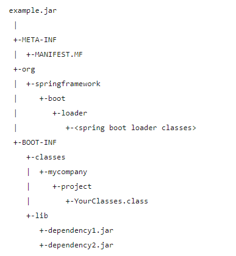
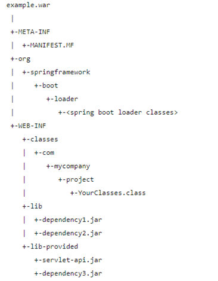
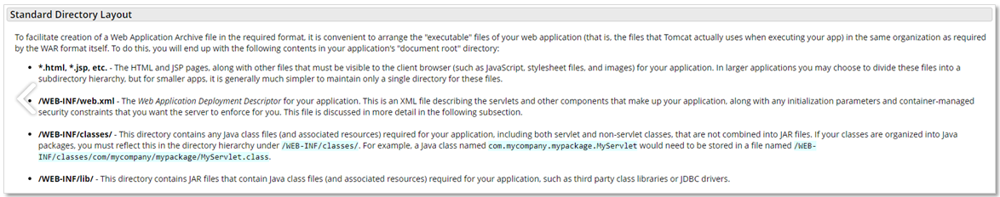

## [WAR v.s. JAR]

JAR : Java ARchive

- JAVA 어플리케이션이 동작할 수 있도록 자바 프로젝트를 압축한 파일
- Class (JAVA리소스, 속성 파일), 라이브러리 파일을 포함함
- JRE(JAVA Runtime Environment)만 있어도 실행 가능함 (java -jar 프로젝트네임.jar)

WAR : Web Application aRchive

- Servlet / Jsp 컨테이너에 배치할 수 있는 웹 애플리케이션(Web Application) 압축파일 포맷
- 웹 관련 자원을 포함함 (JSP, Servlet, JAR, Class, XML, HTML, Javascript)
- 사전 정의된 구조를 사용함 (WEB-INF, META-INF)
- 별도의 웹서버(WEB) or 웹 컨테이너(WAS) 필요
- 즉, JAR파일의 일종으로 웹 애플리케이션 전체를 패키징 하기 위한 JAR 파일이다.

배포 시 선택조건

- Springboot + JSP의 조합을 JAR로 패키징하여 빌드하면 WhiteLabel Error Page 오류가 발생한다. 이는 내장 톰캣을 사용하는 스프링 부트의 애플리케이션에서 JSP 템플릿 지원이 안되기 때문. JAR 파일구조는 tomcat이 JSP를 찾는 디렉토리인 WEB-INF 디렉토리가 없기 때문에 발생하는 이슈임.
- JSP를 사용하거나 외장 WAS를 사용하는 경우, bootWar로 빌드한 Executable WAR를 사용해야함.
- Springboot의 가이드 표준은 JAR의 사용을 권장하고 있음.

JAR File Structure

- JAR 파일구조는 다음과 같다.
- 
- 구조 설명
  - BOOT-INF
    - 개발자가 직접 작성한 클래스 파일들(classes)과, 의존성 주입을 통한 jar 파일(lib)들로 구성되어 있다.
    - 그림에는 없지만 classpath.idx라는 파일도 포함되어 있는데, 이는 classpath에 추가될 jar 파일들의 목록(lib 폴더 안에 있는 jar 파일)을 정의한 것이다. 이는 "일반적인 JAR 파일은 중첩된 JAR 구조를 지원하지 않는다"는 단점을 보완하기 위해 스프링 부트가 고안해 낸 방법으로, jar 파일 리스트를 확인하여 중첩된 JAR 구조를 지원할 수 있도록 한다.
    - classpath.idx 예시
      ```
      - "ojdbc8.jar"
      - "sitemesh-3.0.1.jar"
      - "querydsl-apt-4.1.4.jar"
      - "spring-boot-starter-web-2.3.4.RELEASE.jar"
      - "spring-boot-starter-data-jpa-2.3.4.RELEASE.jar"
      - "querydsl-jpa-4.3.1.jar"
      - "spring-boot-starter-security-2.3.4.RELEASE.jar"
      …
      ```
  - META_INF
    - 프로젝트 매니페스트 파일(MANIFEST.MF)을 포함하는 폴더이다. 매니페스트 파일은 파일 그룹을 위한 메타데이터(이름, 버전 번호, 라이선스, 프로그램의 구성 등)를 포함하는 파일이다.
    - MANIFEST.MF 예시
      ```
      Manifest-Version: 1.0
      Spring-Boot-Classpath-Index: BOOT-INF/classpath.idx
      Start-Class: com.example.demo.DemoApplication
      Spring-Boot-Classes: BOOT-INF/classes/
      Spring-Boot-Lib: BOOT-INF/lib/
      Spring-Boot-Version: 2.3.4.RELEASE
      Main-Class: org.springframework.boot.loader.JarLauncher
      ```
    - 일반적인 JAR File의 MANIFEST에서 Main-Class는 Main메서드가 존재하는 클래스로 설정되지만, 스프링 부트의 Main-Class에서는 JarLauncher라는 클래스로 설정되어있다. (cf. WAR File에서는 WarLauncher)
    - JarLauncher를 통한 Jar의 실행방식은 아래 순서로 이루어진다.
      - (1) org.springframework.boot.loader.jar.JarFile: 내장 jar 인식
      - (2) org.springframework.boot.loader.Launcher 실행
      - (3) Start-Class에 선언된 클래스의 Main메서드 실행 (com.example.demo.DemoApplication)
  - org
    - org 폴더 안에는 위에서 설명한 Springboot loader classes 모듈이 저장되어 있다.

WAR File Structure

- WAR 파일구조는 다음과 같다.
- 
- 구조 설명
  - WEB_INF
    - 개발자가 직접 입력한 class와 jar 파일, JSP 일 경우 view 파일들까지 포함되어 있는 디렉터리 이다. 아래 이미지는 Tomcat 사이트에서 설명하는 기본 디렉토리 구조로, WAR File Structure의 구조와 유사하단 것을 알 수 있다. 이처럼 웹 애플리케이션의 사전 정의된 구조를 따르고 있기 때문에, 외장 WAS 나 JSP를 사용할 일이 있다면 WAR를 이용하여 배포해야 한다.
    - 
  - META-INF
    - JAR File과 동일하게 MANIFEST.MF 파일을 확인할 수 있다. 간혹 WAR파일은 단독으로 실행이 불가능하다는 이야기를 듣곤 했는데, Spring boot의 WAR는 단독으로 실행이 가능하다(bootWar로 빌드하였을 경우). 그 이유는 Main-Class에 Spring loader로 설정되어 있기 때문이다.
    - 동작 원리는 JarLauncher와 유사하므로, MANIFEST.MF 파일 구조만 기재하고 넘어간다.
      ```
      Manifest-Version: 1.0
      Start-Class: com.example.demo.DemoApplication
      Spring-Boot-Classes: WEB-INF/classes/
      Spring-Boot-Lib: WEB-INF/lib/
      Spring-Boot-Version: 2.3.4.RELEASE
      Main-Class: org.springframework.boot.loader.WarLauncher
      ```
