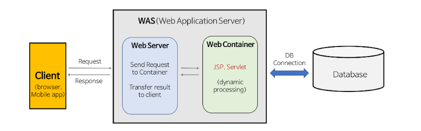
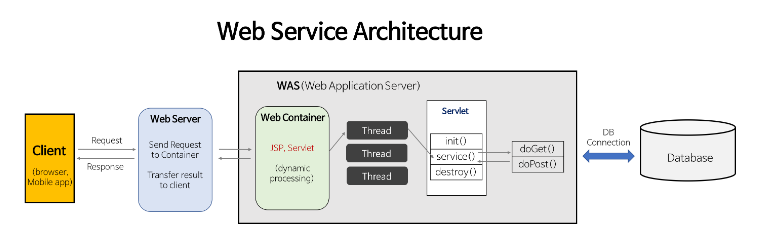

## Web Server?

## Web Application Server?

## Web Application Framework?

## What The F..?

  

### 1. Static Resource & Dynamic Resource

- static resource
  - Web Server는 파일 경로 이름을 받아 경로와 일치하는 static resource를 반환한다.
  - 항상 동일한 static page를 반환한다.
  - ex) images, html, css, javascript file etc.
- dynamic resource
  - http request 내용에 맞는 dynamic resource를 반환한다.
  - servlet을 통해 비지니스 로직을 처리하여 결과물을 web server에 전달
  - 개발자는 servlet에 doGet() 메소드를 구현한다.

### 2. CGI & Servlet & Web Container

- CGI(Common Gateway Interface)
  - 웹 서버에서 동적인 데이터를 반환하려면 요청에 알맞는 프로그램(A)이 필요할 뿐만 아니라, 그 알맞는 프로그램(A)에 적절히 넘겨 주는 중간자 역할을 하는 프로그램(B)이 필요한데 CGI 프로그램(B)이 그 역할을 한다.
  - CGI는 특별한 라이브러리나 도구를 의미하는 것이 아닌 웹 서버와 외부 프로그램 사이에서 정보를 주고 받는 방법, 즉 표준 스펙이자 Interface를 말한다.
  - 서버 프로그램과 외부 프로그램과의 연계법을 의미하기 때문에 PHP, Perl, Python등 다양한 언어로 CGI를 적용 시킬 수 있다.
  - JAVA에서는 CGI와 유사한 방식으로 구현된 서블릿(Servlet) 이라는 프로그램이 존재한다.
  - 
- Servlet
  - 자바 서블릿은 웹 서버의 성능을 향상하기 위해 사용되는 자바 클래스의 일종이다.
  - 자바 서블릿은 자바 EE 사양의 일부분으로, 클라이언트의 요청에 대해 처리하는 역할을 하는 자바 프로그램
  - JSP는 Servlet 엔진을 통해 컴파일되면 Serlvet으로 변환되어 내부적으로 Servlet으로 동작한다.
  - 
- CGI vs Servlet
  - CGI는 매 요청이 들어올 때마다 프로세스가 생성되고 각각의 CGI 구현체를 통해 처리한다. 서블릿은 각 요청마다 스레드가 생성되거나 스레드 풀에서 기존의 스레드를 사용하여 동작한다.
  - 메모리를 공유하는 쓰레드에 비해서 프로세스는 각자의 공간을 지니기 때문에 무겁고 생성되는데 시간이 상대적으로 오래 걸린다. 또한 Servlet은 싱글톤 패턴을 통해 사용되기 때문에 하나의 구현체를 통해 동작할 수 있다.
- Web Container
  - 보통 웹 컨테이너는 서블릿 컨테이너를 의미한다.
  - 동적 데이터 생성을 위한 런타임 및 라이브러리 패키지이다.
  - 서블릿을 만들었다고 해서 스스로 작동하는 것이 아니고 서블릿을 생성, 소멸 및 관리해주는 것이 필요한데 이 역할을 하는 것이 바로 서블릿 컨테이너이다.
  - Web Container 역할
    1. 웹 서버와의 통신 지원
    2. 서블릿 생명주기 관리
    3. 멀티쓰레드 지원 및 관리
    4. 선언적인 보안 관리

### 3. Web Server & WAS

- Web Server

  - Web Server 개념
    - SW & HW 로 구분된다.
    - HW : Web Server가 설치되어 있는 컴퓨터
    - SW : 웹 브라우저로부터 HTTP Request를 받아 static resource를 반환하는 프로그램
  - Web Server 기능
    - HTTP 프로토콜을 기반으로 하여 클라이언트(웹 브라우저 또는 웹 크롤러)의 요청을 서비스 하는 기능을 담당한다.
    - 요청에 따라 아래의 두 가지 기능 중 적절하게 선택하여 수행한다.
    - 정적 컨텐츠 제공
      - WAS 없이 Web Server 만 구동되는 경우, 정적 컨텐츠만 제공할 수 있다.
    - 동적 컨텐츠 제공
      - 클라이언트가 요청한 HTTP Request를 WAS에 전달하고, WAS 해당 요청에 대한 처리 결과물을 response 객체 형태로 반환하면 HTTP Response로 변환하여 클라이언트에게 제공한다.
  - Web Server : Apache Server, Nginx, IIS (Windows Web Serber) 등

- WAS : Web Application Server

  - Application Server 등장배경
    - 초창기 인터넷에서는 정적 데이터에 대한 수요가 높았기 때문에 기능적으로 어플리케이션 서버를 따로 나누지 않고 웹 서버라는 개념을 통칭해서 사용하였다. 하지만 유저가 증가함에 따라 더 많은 서비스와 기능이 필요하게 되었고 그로 인한 서버의 부하를 줄이기 위해 따로 서버를 나누게 되었는데 이를 어플리케이션 서버라고 한다.
    - 웹 서비스가 복잡해지고 기능이 다양해지며 데이터를 가공해서 처리하는 비즈니스 로직이 필요하게 되었다. 웹 서버 하나에서 이러한 로직을 처리하는데는 부하가 커서 별도의 서버가 필요하게 되었고 이를 어플리케이션 서버라 부르게 되었다.
    - 어플리케이션 서버는 인터넷 상에서 HTTP를 통해 사용자 컴퓨터나 장치에 비즈니스 로직을 수행해 주는 미들웨어로 볼 수 있다.
  - WAS 개념
    - WAS는 J2EE의 스펙을 구현하여, 서블릿(Servlet)이나 JSP로 작성된 애플리케이션을 실행하는 소프트웨어이다.
    - HTTP를 통해 컴퓨터나 장치에 애플리케이션을 수행해주는 미들웨어(소프트웨어 엔진)이다.
    - WAS는 Request를 분석하여 비즈니스 로직이나 트랜잭션을 처리하는데 이때 서블릿을 사용한다. 이 서블릿 관리를 웹 컨테이너(서블릿 컨테이너)가 하는 것이다.
  - WAS 기능
    - WAS : Web Server + Web Container
    - Web Server는 정적 데이터를 제공하고 Web Container는 비지니스 로직 처리를 통한 동적 데이터를 제공한다.
  - WAS : Tomcat, JBoss, JEUS, Web Sphere 등

- Web Server와 WAS를 구분하는 이유?
  - Web Server는 정적 데이터만 처리하도록 기능 분리
  - WAS는 비지니스 로직을 처리하여 동적 데이터만 처리하도록 기능 분리
    1. Client가 Server로 Request를 보낸다.
    2. Web Server는 Application Server로 Request를 전달하여 비지니스 로직을 처리한 결과값을 Response로 전달받는다.
    3. Web Server는 Application Server로부터 전달받은 Response를 HTTPResponse 형태로 Client에게 반환한다.
    4. Client는 Request 값에 따른 Response 값을 HTML 문서 형태로 전달받은 후, Dependencies 정적 파일들을 다시 Server에 요청한다.
    5. Web Server는 정적 파일 요청을 Application Server에게 전달하지 않고 직접 처리한다.
  - 기능 분리가 필요한 이유
    - 기능을 분리하여 Server 부하 방지한다.
    - 물리적 분리를 통한 보안 강화
      - SSL 암복호화 처리 등을 Web Server에서 처리
    - 여러 대의 WAS를 사용할 수 있다.
      - Web Server에서 Load Balancing을 할 수 있다.
      - fail over & fail back 처리에 유리하다.
      - WAS에서 오류가 발생하면 다른 WAS로 Request를 돌려서 무중단 서비스가 가능해진다.
    - 다양한 환경의 웹 애플리케이션 서비스가 가능하다.
      - 하나의 서버에서 PHP Application과 Java Application을 함께 사용할 수 있다.

### 4. Web Service Architecture

### 5. Web Application Framework

- 웹 프레임워크(web framework, WF) 또는 웹 애플리케이션 프레임워크(web application framework, WAF)는 동적인 웹 페이지나, 웹 애플리케이션, 웹 서비스 개발 보조용으로 만들어지는 애플리케이션 프레임워크의 일종이다.
- 웹 페이지를 개발하는 과정에서 겪는 어려움을 줄이는 것이 주 목적으로 통상 데이터베이스 연동, 템플릿 형태의 표준, 세션 관리, 코드 재사용 등의 기능을 포함하고 있다.
- ex ) Spring(Java), Django(Python), Express(Node.js & Nest.js), Ruby on Rails(Ruby)
